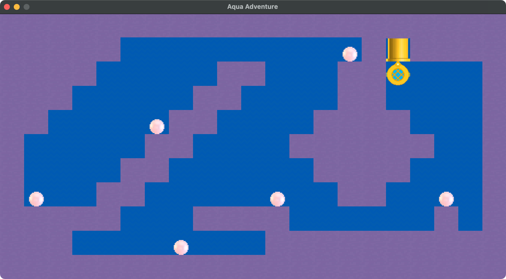

# so_long

## Project

so_long is a small 2D game created using C and the MiniLibX library. MiniLibX includes functions that render images to a pop-up window and take player input.

## Download and Play

Run the following to download and play Aqua Adventure (Mac only)

```cd ~/Desktop && git clone https://github.com/LoredanaLoSurdo/so_long.git && cd so_long && make```

## Map Selection

Play map 1 ```./so_long map_srcs/map1.ber```  
Play map 2 ```./so_long map_srcs/map2.ber```       
Play map 3 ```./so_long map_srcs/map3.ber```  

## How to Play

Navigate the map with the W, A, S, D keys and collect all the pearls.
Once all the pearls have been collected, exit through the yellow pipe.


